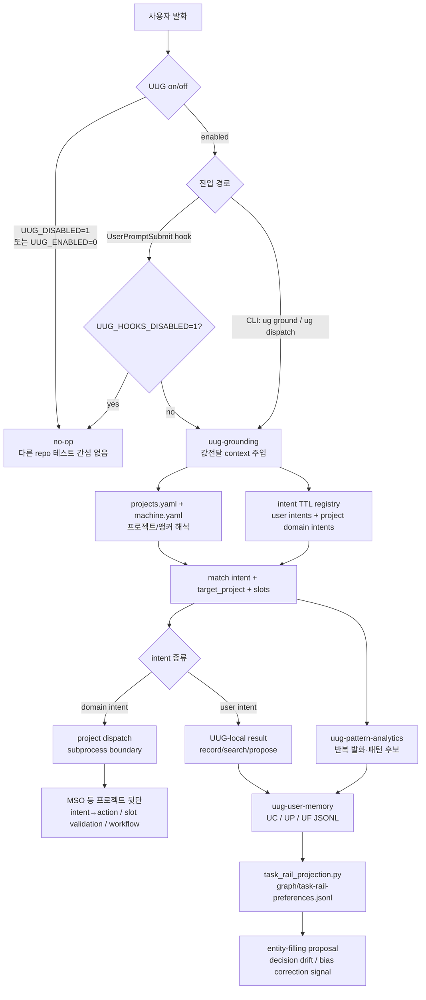

# user-utterance-grounding (UUG) v0.0.5

UUG는 **사용자 발화·의도 중심의 크로스-프로젝트 grounding 도구**다 — [MSO](https://github.com/WMJOON/multi-swarm-orchestrator)의 user-side 대응.

MSO가 **repository 단위의 작업 컨텍스트**(구조·워크플로·작업 기억)를 선언해 *에이전트가* 일관되게 작업하게 한다면, UUG는 그 방대한 작업을 **사용자가** 수행하도록 돕기 위해 만들어졌다. 사람의 인지적 한계를 전제로, 작업 정보의 **hand-off를 인력에만 의존하지 않고** 에이전트가 떠받치게 한다 — 어느 프로젝트인지, 그게 이 머신 어디에 있는지, 지난번에 무엇을 어떻게 하기로 했는지를 사용자가 매번 머리에 이고 다시 설명하지 않도록.

---

## UUG가 해결하는 문제

사용자가 여러 프로젝트를 횡단하며 에이전트와 일할 때 세 가지 마찰이 반복된다.

1. **타깃 모호**: "이거 정리하자"·"착수해줘" — 어느 프로젝트에 대한 요청인지 명시되지 않으면, 에이전트가 매번 되묻거나 잘못 짚는다.
2. **위치 표류**: 같은 프로젝트가 머신마다 다른 절대경로에 있다. 사용자·에이전트가 경로를 기억하거나 다시 입력해야 한다.
3. **기억·hand-off 부재**: 선호·결정·반복 패턴이 세션이 끝나면 사라진다. 다음 세션으로의 인계가 전적으로 사용자의 재설명에 의존한다.

UUG는 이 셋에 각각 대응한다.

| 문제 | UUG의 답 | 핵심 |
|------|----------|------|
| 타깃 모호 | 발화 → intent → 타깃 프로젝트 **grounding** | `uug-grounding` |
| 위치 표류 | 머신-무관 레지스트리 + 런타임 **자가복구** | `projects.yaml` 앵커 + `machine.yaml` + `.obsidian` 탐지 |
| 기억·hand-off 부재 | user-scope **영속 기억** + 패턴 분석 | `uug-user-memory` · `uug-pattern-analytics` |



---

## 변경 이력

릴리스별 변경 사항은 [docs/changelog.md](docs/changelog.md)에 둔다.

---

## 네 가지 핵심

### 1. Utterance → Intent Grounding (namespace-agnostic 멀티-레지스트리)

발화를 받아 `{target_project, intent, slots}`로 정렬한다. user intent(전 프로젝트 공통)와 각 프로젝트의 **도메인 intent**를 한 그래프로 합쳐 ground한다 — `projects.yaml`에 프로젝트별 `intent_registry`(도메인 intent TTL)를 선언하면, lookup이 술어 로컬명 기준으로 namespace 무관하게 둘을 union한다. 도메인 intent가 매칭되면 `source_project`가 타깃을 함의.

```
발화 "audit log 보여줘"
  → user 레지스트리 + MSO intents.ttl 합집합에서 ground
  → intent=query_audit_log, source_project=multi-swarm-orchestrator
```

### 2. 머신-무관 위치 레지스트리

프로젝트 위치를 **명명된 앵커 + 머신 설정**으로 관리한다. `projects.yaml`(앵커명 + 상대경로, 싱크됨)과 `machine.yaml`(앵커→절대경로, gitignore)을 분리해, 같은 레지스트리가 어느 머신에서나 동작한다.

- `vault` 앵커는 `machine.yaml`에 적지 않아도 된다 — `.obsidian` 마커를 위로 탐지해 **런타임 자가복구**. iCloud 동기로 `machine.yaml`이 머신 간 복제돼도 절대경로가 오염되지 않는다.
- `ug resolve <project>` 로 현재 머신 절대경로 해석, `ug doctor` 로 멀티머신 경로 표류 점검.

### 3. §11 dispatch — UUG(앞단) → 프로젝트(뒷단)

**경계: utterance→intent = UUG / intent→action = 각 프로젝트.** 도메인 intent의 뒷단은 그 프로젝트가 소유한다. `ug dispatch`가 `projects.yaml`의 `dispatch`(kind=cli, entry) 선언에 따라 그 프로젝트의 CLI를 **subprocess 위임**한다.

```
ug dispatch "ticket-217 재실행"
  → UUG 앞단: intent=dispatch_ticket (target=multi-swarm-orchestrator)
  → 프로젝트 뒷단: pipeline.py 에 subprocess 위임
  → GroundedCommand {slots:{ticket_ref, reason}, tier:UUG, ...}
```

**디커플**: 피호출 프로젝트는 UUG를 import하지 않는다 — 단방향 의존, 프로세스 경계. 프로젝트의 독립 테스트성이 보존된다. dispatch 미선언 프로젝트/user intent는 UUG 자체 grounding 결과로 폴백.

### 4. User-scope 영속 기억 + 패턴 분석

- **uug-user-memory**: user-context/user-pattern/user-preference(UC/UP/UF)를 jsonl + 시맨틱 인덱스 + 그래프로 자산화한다. MSO work-memory의 schema-driven 엔진을 user 스코프로 재사용하지만 타입은 UC/UP/UF로 제한한다. project-scope worklog는 각 프로젝트가 소유한다. "전에 이거 어떻게 하기로 했지?" 시맨틱 검색.
- **uug-pattern-analytics**: 발화→intent 빈도·반복(워크플로 패턴/마찰)을 측정해 user-pattern 후보를 낸다 → uug-user-memory로 기록, grounding 트리거 정련 신호로 환류. 크로스-프로젝트 user 발화 스트림 대상.

---

## 스킬팩 구성 (orchestration 패턴 — MSO/MSM 류)

| 스킬 | 역할 | 핵심 스크립트 | 상태 |
|------|------|-----------|------|
| `uug-orchestration` | 라우터/진입점 + 정책 | — | ✅ |
| `uug-grounding` | 발화→{target_project, intent, slots} · intent TTL lookup · 위치 레지스트리(resolve/doctor) · `ug dispatch` · UserPromptSubmit 값전달 | `scripts/ug.py`, `src/lookup.py` | ✅ |
| `uug-user-memory` | UC/UP/UF 영속 (vendored schema-driven wm 엔진 + bootstrap) | `bootstrap.py`, vendored `wm_node.py` | ✅ |
| `uug-pattern-analytics` | 발화→intent 빈도·반복 탐지 → user-pattern 후보 | — | ✅ MVP |

---

## 빠른 시작

```bash
cd skills/uug-grounding
pip install rdflib pyyaml
cp projects.example.yaml projects.yaml   # 본인 프로젝트 등록 (machine.yaml 은 vault 자동탐지로 생략 가능)
bash install.sh                          # ~/.claude/skills 심링크 + UserPromptSubmit 훅 등록
bash install.sh --codex                  # ~/.codex/skills 심링크 + Codex UserPromptSubmit 훅 등록
bash install.sh --all                    # Claude Code + Codex 등록 (양쪽 UserPromptSubmit 훅)
```

```bash
ug resolve <project>             # 프로젝트 식별자 → 이 머신 절대경로
ug doctor                        # 멀티머신 경로 표류 점검 (✓ found / ✗ missing / ⚠ anchor)
ug ground "이거 정리하자"          # 발화 → {target_project, intent, slots}
ug dispatch "ticket-217 재실행"   # 도메인 intent → 프로젝트 뒷단 CLI 위임
ug use <project>                 # 현재 작업 프로젝트 고정 (선택)
```

---

## 설계 원칙

**User-scope, cross-project (global 레이어).** MSO가 프로젝트 단위라면 UUG는 사용자/전-프로젝트 레이어다. 사용자의 작업 전반을 가로질러 정렬·기억한다.

**Propose ≠ execute.** UUG는 발화를 ground·정렬하고 **제안**한다. 워크플로·액션의 **실행**은 각 프로젝트(MSO 등)가 소유한다. UUG는 워크플로우를 실행·관리하지 않는다. (§11 경계)

**User memory ≠ project worklog.** UUG는 UC/UP/UF를 기록한다. workflow node 실행 기록, auditlog, worklog는 프로젝트 레이어의 책임이다. UserPromptSubmit hook은 기록 side effect 없이 grounding context만 주입한다.

**Machine-portable.** 절대경로 하드코딩 없음 — `__file__`/`.obsidian` 자동탐지/env/anchor. iCloud 동기·멀티머신 안전.

**Privacy-first.** 도구는 공개하되 **사용자 데이터는 사적**으로 — `projects.yaml`·`machine.yaml`·`.session.json`은 gitignore, 배포는 `*.example.yaml`만. push 전 `check-private.sh` PII 게이트(절대경로·이메일·vault 시그니처·추적된 사용자 데이터 차단).

**HITL.** grounding이 모호하거나 필수 슬롯이 미충족이면 사용자에게 확인한다.

---

## 의존성

```
Python 3.10+
rdflib >= 7.0     # intent 레지스트리 TTL lookup
PyYAML >= 6.0
```

---

## 로드맵 (v0.0.5 이후)

- **Lv30 LLM fallback**: keyword-miss(~20%) 발화의 LLM 복구 경로 (현재 Lv10 키워드 grounding만).
- **횡단 패턴 → 엄브렐러 제안**: `uug-pattern-analytics`가 사용자가 N개 프로젝트를 반복 횡단하는 패턴을 관측해 "엄브렐러/모노로 합쳐 가로지르는 워크플로우 생성"을 **제안**(실행은 프로젝트가). 미구현.
- **user-memory 데이터 레이어**: UC/UP/UF 영속 저장소 위치·이름 확정.

---

## 참고

- [`skills/uug-orchestration/SKILL.md`](skills/uug-orchestration/SKILL.md) — 라우터/정책 레이어
- [`skills/uug-grounding/SKILL.md`](skills/uug-grounding/SKILL.md) — grounding + 레지스트리 + dispatch
- [`skills/uug-user-memory/SKILL.md`](skills/uug-user-memory/SKILL.md) — UC/UP/UF 영속
- [`skills/uug-pattern-analytics/SKILL.md`](skills/uug-pattern-analytics/SKILL.md) — 패턴 분석
- 선례: MSO [`mso-orchestration`](https://github.com/WMJOON/multi-swarm-orchestrator) · MSM `msm-orchestration`
