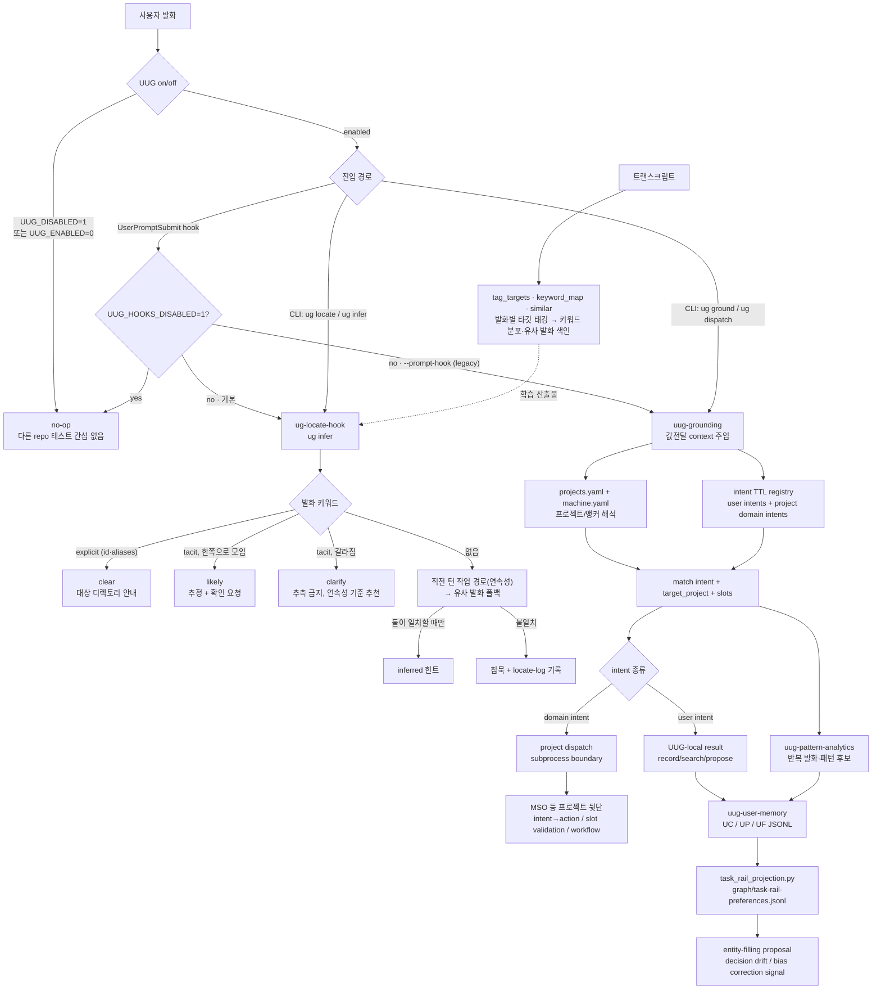

# user-utterance-grounding (UUG) v0.3.1

UUG는 **사용자 발화·의도 중심의 크로스-프로젝트 grounding 도구**다 — [MSO](https://github.com/WMJOON/multi-swarm-orchestrator)의 user-side 대응.

MSO가 **repository 단위의 작업 컨텍스트**(구조·워크플로·작업 기억)를 선언해 *에이전트가* 일관되게 작업하게 한다면, UUG는 그 방대한 작업을 **사용자가** 수행하도록 돕기 위해 만들어졌다. 사람의 인지적 한계를 전제로, 작업 정보의 **hand-off를 인력에만 의존하지 않고** 에이전트가 떠받치게 한다 — 어느 프로젝트인지, 그게 이 머신 어디에 있는지, 지난번에 무엇을 어떻게 하기로 했는지를 사용자가 매번 머리에 이고 다시 설명하지 않도록.

---

## UUG가 해결하는 문제

사용자가 여러 프로젝트를 횡단하며 에이전트와 일할 때 세 가지 마찰이 반복된다.

1. **타깃 모호**: "이거 정리하자"·"착수해줘" — 어느 프로젝트에 대한 요청인지 명시되지 않으면, 에이전트가 매번 되묻거나 잘못 짚는다.
2. **위치 표류**: 같은 프로젝트가 머신마다 다른 절대경로에 있다. 사용자·에이전트가 경로를 기억하거나 다시 입력해야 한다.
3. **기억·hand-off 부재**: 선호·결정·반복 패턴이 세션이 끝나면 사라진다. 다음 세션으로의 인계가 전적으로 사용자의 재설명에 의존한다.
4. **지칭 오탐**: "온톨로지 작업하자"의 '온톨로지'처럼 여러 프로젝트에 걸친 말을 에이전트가 한 곳으로 단정하거나, 엉뚱한 디렉토리에서 연 세션에서 대상을 못 찾는다.

UUG는 이 넷에 각각 대응한다.

| 문제 | UUG의 답 | 핵심 |
|------|----------|------|
| 타깃 모호 | 발화 → intent → 타깃 프로젝트 **grounding** | `uug-grounding` |
| 위치 표류 | 머신-무관 레지스트리 + 런타임 **자가복구** | `projects.yaml` 앵커 + `machine.yaml` + `.obsidian` 탐지 |
| 기억·hand-off 부재 | user-scope **영속 기억** + 패턴 분석 | `uug-user-memory` · `uug-pattern-analytics` |
| 지칭 오탐 | 발화별 타깃 **태깅 이력**으로 explicit/tacit 판정 + 연속성 추론, 모호하면 **clarify** | `ug locate` · `ug infer` · `ug-locate-hook.py` |


```mermaid
flowchart TD
    A["사용자 발화"] --> B{"UUG on/off"}
    B -- "UUG_DISABLED=1<br/>또는 UUG_ENABLED=0" --> Z["no-op<br/>다른 repo 테스트 간섭 없음"]
    B -- "enabled" --> C{"진입 경로"}

    C -- "UserPromptSubmit hook" --> H{"UUG_HOOKS_DISABLED=1?"}
    H -- "yes" --> Z
    H -- "no · 기본" --> LH["ug-locate-hook<br/>ug infer"]
    H -- "no · --prompt-hook (legacy)" --> G["uug-grounding<br/>값전달 context 주입"]

    LH --> KW{"발화 키워드"}
    KW -- "explicit (id·aliases)" --> CL["clear<br/>대상 디렉토리 안내"]
    KW -- "tacit, 한쪽으로 모임" --> LK["likely<br/>추정 + 확인 요청"]
    KW -- "tacit, 갈라짐" --> CF["clarify<br/>추측 금지, 연속성 기준 추천"]
    KW -- "없음" --> CT["직전 턴 작업 경로(연속성)<br/>→ 유사 발화 폴백"]
    CT -- "둘이 일치할 때만" --> IN["inferred 힌트"]
    CT -- "불일치" --> SL["침묵 + locate-log 기록"]

    C -- "CLI: ug ground / ug dispatch" --> G
    C -- "CLI: ug locate / ug infer" --> LH

    G --> R["projects.yaml + machine.yaml<br/>프로젝트/앵커 해석"]
    G --> I["intent TTL registry<br/>user intents + project domain intents"]
    R --> M["match intent + target_project + slots"]
    I --> M

    M --> D{"intent 종류"}
    D -- "user intent" --> U["UUG-local result<br/>record/search/propose"]
    D -- "domain intent" --> P["project dispatch<br/>subprocess boundary"]
    P --> MSO["MSO 등 프로젝트 뒷단<br/>intent→action / slot validation / workflow"]

    U --> MEM["uug-user-memory<br/>UC / UP / UF JSONL"]
    M --> ANA["uug-pattern-analytics<br/>반복 발화·패턴 후보"]
    TT["트랜스크립트"] --> TAG["tag_targets · keyword_map · similar<br/>발화별 타깃 태깅 → 키워드 분포·유사 발화 색인"]
    TAG -. "학습 산출물" .-> LH
    ANA --> MEM
    MEM --> TR["task_rail_projection.py<br/>graph/task-rail-preferences.jsonl"]
    TR --> PR["entity-filling proposal<br/>decision drift / bias correction signal"]
```

---

## 변경 이력

릴리스별 변경 사항은 [docs/changelog.md](docs/changelog.md)에 둔다.

---

## 다섯 가지 핵심

### 1. Utterance → Intent Grounding (namespace-agnostic 멀티-레지스트리)

발화를 받아 `{target_project, intent, slots}`로 정렬한다. user intent(전 프로젝트 공통)와 각 프로젝트의 **도메인 intent**를 한 그래프로 합쳐 ground한다 — `projects.yaml`에 프로젝트별 `intent_registry`(도메인 intent TTL)를 선언하면, lookup이 술어 로컬명 기준으로 namespace 무관하게 둘을 union한다. 도메인 intent가 매칭되면 `source_project`가 타깃을 함의.

```
발화 "audit log 보여줘"
  → user 레지스트리 + MSO intents.ttl 합집합에서 ground
  → intent=query_audit_log, source_project=multi-swarm-orchestrator
```

### 2. 머신-무관 위치 레지스트리

프로젝트 위치를 **명명된 앵커 + 머신 설정**으로 관리한다. `projects.yaml`(앵커명 + 상대경로, 싱크됨)과 `machine.yaml`(앵커→절대경로, gitignore)을 분리해, 같은 레지스트리가 어느 머신에서나 동작한다.

- `vault` 앵커는 `machine.yaml`에 적지 않아도 된다 — `.obsidian` 마커를 위로 탐지해 **런타임 자가복구**. iCloud 동기로 `machine.yaml`이 머신 간 복제돼도 절대경로가 오염되지 않는다.
- `machine.yaml`이 동기화돼 여러 머신의 경로가 섞이면 `hosts.<hostname>.anchors` 섹션이 공통 `anchors` 위에 덮어쓴다. `null`로 둔 앵커는 "이 머신에 없음"으로 표시된다. (v0.3.0)
- `ug resolve <project>` 로 현재 머신 절대경로 해석, `ug doctor` 로 멀티머신 경로 표류 점검.

### 3. §11 dispatch — UUG(앞단) → 프로젝트(뒷단)

**경계: utterance→intent = UUG / intent→action = 각 프로젝트.** 도메인 intent의 뒷단은 그 프로젝트가 소유한다. `ug dispatch`가 `projects.yaml`의 `dispatch`(kind=cli, entry) 선언에 따라 그 프로젝트의 CLI를 **subprocess 위임**한다.

```
ug dispatch "ticket-217 재실행"
  → UUG 앞단: intent=dispatch_ticket (target=multi-swarm-orchestrator)
  → 프로젝트 뒷단: pipeline.py 에 subprocess 위임
  → GroundedCommand {slots:{ticket_ref, reason}, tier:UUG, ...}
```

**디커플**: 피호출 프로젝트는 UUG를 import하지 않는다 — 단방향 의존, 프로세스 경계. 프로젝트의 독립 테스트성이 보존된다. dispatch 미선언 프로젝트/user intent는 UUG 자체 grounding 결과로 폴백.

### 4. User-scope 영속 기억 + 패턴 분석

- **uug-user-memory**: user-context/user-pattern/user-preference(UC/UP/UF)를 jsonl + 시맨틱 인덱스 + 그래프로 자산화한다. MSO work-memory의 schema-driven 엔진을 user 스코프로 재사용하지만 타입은 UC/UP/UF로 제한한다. project-scope worklog는 각 프로젝트가 소유한다. "전에 이거 어떻게 하기로 했지?" 시맨틱 검색.
- **uug-pattern-analytics**: 발화→intent 빈도·반복(워크플로 패턴/마찰)을 측정해 user-pattern 후보를 낸다 → uug-user-memory로 기록, grounding 트리거 정련 신호로 환류. 크로스-프로젝트 user 발화 스트림 대상.

### 5. Locate / Infer — 발화별 타깃 태깅과 지칭 추론 (v0.3.0)

**오탐을 막는 장치**이자 **엉뚱한 세션에서 대상 디렉토리를 찾아 주는 장치**다. 과거 발화마다 "실제로 어느 프로젝트에서 작업했는가"를 태깅해 두고, 그 이력으로 새 발화의 지칭 대상을 판정한다.

```
트랜스크립트(Claude Code·Codex)
  → tag_targets.py   발화마다 utterance_target(키워드) / work_target(그 턴의 도구 경로) — 원문 미저장
  → keyword_map.py   키워드 → 실제 작업 프로젝트 분포 (explicit / exclusive / ambiguous / sparse)
  → similar.py       타깃 확정 발화를 zvec 에 색인 (bge-m3)
  → ug infer         매 프롬프트: 키워드 + 연속성 + 유사 발화 → emit 판정
```

| 발화 | 판정 | 넛지 |
|------|------|------|
| explicit(프로젝트 id·`aliases`) | `clear` — 대상 디렉토리 | 항상 |
| tacit(`keywords`), 한쪽으로 모임 | `likely` — 추정 + 확인 요청 | 항상 |
| tacit, 여러 프로젝트로 갈라짐 | `clarify` — 추측 금지, 연속성·유사 발화 기준 추천 표시 | 항상 |
| 키워드 없음 | `inferred` — 직전 턴 타깃 → 유사 발화 폴백 | 둘이 일치할 때만 |

- **연속성이 주 신호다.** 작성자 환경 실측(345건): 직전 턴 타깃 78%, 유사 발화 kNN 49%, cross-encoder 리랭커 50%(채택 안 함). 자세한 수치는 [changelog](docs/changelog.md).
- 현재 세션 디렉토리와 같은 대상이면 침묵한다. 모든 판정은 넛지 여부와 무관하게 `~/.local/share/uug/locate-log.jsonl` 에 **원문 없이** 남아 임계 튜닝 재료가 된다.

---

## 스킬팩 구성 (orchestration 패턴 — MSO/MSM 류)

| 스킬 | 역할 | 핵심 스크립트 | 상태 |
|------|------|-----------|------|
| `uug-orchestration` | 라우터/진입점 + 정책 | — | ✅ |
| `uug-grounding` | 발화→{target_project, intent, slots} · intent TTL lookup · 위치 레지스트리(resolve/doctor) · `ug dispatch` · `ug locate`/`ug infer` · UserPromptSubmit 값전달 | `scripts/ug.py`, `src/lookup.py`, `hooks/ug-locate-hook.py` | ✅ |
| `uug-user-memory` | UC/UP/UF 영속 (vendored schema-driven wm 엔진 + bootstrap) | `bootstrap.py`, vendored `wm_node.py` | ✅ |
| `uug-pattern-analytics` | 발화→intent 빈도·반복 탐지 → user-pattern 후보 · 발화별 타깃 태깅 · keyword-map 학습 · 유사 발화 색인 · 추론 방식 평가 | `analyze.py`, `tag_targets.py`, `keyword_map.py`, `similar.py`, `eval_targets.py` | ✅ |

---

## 빠른 시작

```bash
cd skills/uug-grounding
pip install rdflib pyyaml                # 훅을 실행하는 python3 (3.9+) 에 설치
cp projects.example.yaml projects.yaml   # 본인 프로젝트 등록: aliases(explicit) / keywords(tacit)
bash install.sh                          # ~/.claude/skills 심링크 + UserPromptSubmit 훅(ug-locate-hook) 등록
bash install.sh --codex                  # ~/.codex/skills 심링크 + Codex 훅 등록 → 대화형 codex 에서 /hooks 로 신뢰 승인
bash install.sh --all                    # Claude Code + Codex
```

`machine.yaml`은 `.obsidian` 자동탐지로 생략할 수 있다. 설치 스크립트는 여러 번 실행해도 결과가 같고, 이전 버전이 등록한 UUG 훅이 있으면 교체해 **하나만** 남긴다.

**어떤 훅이 등록되나** (v0.3.1~ 기본값 변경):

| 훅 | 판단 근거 | 대상을 모를 때 | 설치 |
|----|-----------|----------------|------|
| `hooks/ug-locate-hook.py` (기본) | explicit/tacit 키워드 + 직전 턴 작업 경로 + 유사 발화 | 확신할 때만 주입, 모호하면 clarify 지시 | `bash install.sh` |
| `hooks/ug-prompt-hook.py` (legacy) | intent 매칭 + 키워드, 없으면 `last_project` | 마지막 사용 프로젝트로 채움 | `bash install.sh --prompt-hook` |

legacy 훅은 대상을 말하지 않은 발화를 마지막 사용 프로젝트로 채우기 때문에, 여러 프로젝트를 오가면 엉뚱한 곳을 짚기 쉽다. 두 훅을 함께 등록하면 주입이 겹치므로 하나만 쓴다.

CLI (아래 `ug`는 `python3 skills/uug-grounding/scripts/ug.py`의 줄임. 필요하면 `alias ug=...`):

```bash
ug resolve <project>             # 프로젝트 식별자 → 이 머신 절대경로
ug doctor                        # 경로 표류·의존성 점검 (✓ found / ✗ missing / − 이 머신에 없음 / ⚠ anchor)
ug list                          # 등록 프로젝트
ug ground "이거 정리하자"          # 발화 → {target_project, intent, slots}
ug dispatch "ticket-217 재실행"   # 도메인 intent → 프로젝트 뒷단 CLI 위임
ug use <project>                 # 현재 작업 프로젝트 고정 (legacy 훅·ground 용)
ug locate "온톨로지에서 찾아줘"     # 지칭 대상 (clear / likely / clarify / none)
ug infer "좋아 이어서 하자" --transcript <session.jsonl>   # + 연속성·유사 발화 → emit 판정 JSON
```

**locate/infer 학습 파이프라인** (선택. 없으면 `projects.yaml` 등록 소유자만으로 판정하고, 연속성은 학습 없이도 동작):

```bash
cd skills/uug-pattern-analytics
python3 scripts/tag_targets.py            # 발화별 타깃 태깅 (증분, Claude Code·Codex 트랜스크립트)
python3 scripts/keyword_map.py            # tacit 키워드 → 작업 프로젝트 분포

# 유사 발화: zvec 은 Python ≥3.10. ug.py 는 기본으로 ~/.local/share/uug/venv 를 찾는다 (UUG_VENV_PY 로 변경)
python3.11 -m venv ~/.local/share/uug/venv
~/.local/share/uug/venv/bin/pip install zvec numpy pyyaml rdflib
~/.local/share/uug/venv/bin/python scripts/similar.py index
~/.local/share/uug/venv/bin/python scripts/eval_targets.py --gate   # 힌트 규칙 실측
```

**수동 등록** (install.sh 를 쓰지 않을 때) — Claude Code `~/.claude/settings.json`:

```json
{"hooks": {"UserPromptSubmit": [{"hooks": [{"type": "command", "timeout": 10,
  "command": "python3 \"$HOME/.claude/skills/uug-grounding/hooks/ug-locate-hook.py\""}]}]}}
```

Codex `~/.codex/config.toml` (등록 후 대화형 `codex` 에서 `/hooks` 로 신뢰 승인):

```toml
[features]
hooks = true

[[hooks.UserPromptSubmit]]
[[hooks.UserPromptSubmit.hooks]]
type = "command"
command = 'python3 "$HOME/.codex/skills/uug-grounding/hooks/ug-locate-hook.py" --codex'
timeout = 10
```

---

## 설계 원칙

**User-scope, cross-project (global 레이어).** MSO가 프로젝트 단위라면 UUG는 사용자/전-프로젝트 레이어다. 사용자의 작업 전반을 가로질러 정렬·기억한다.

**Propose ≠ execute.** UUG는 발화를 ground·정렬하고 **제안**한다. 워크플로·액션의 **실행**은 각 프로젝트(MSO 등)가 소유한다. UUG는 워크플로우를 실행·관리하지 않는다. (§11 경계)

**User memory ≠ project worklog.** UUG는 UC/UP/UF를 기록한다. workflow node 실행 기록, auditlog, worklog는 프로젝트 레이어의 책임이다. UserPromptSubmit hook은 user-memory 기록·dispatch·worklog 없이 context만 주입한다. 예외는 `ug infer --log`의 판정 로그 하나로, 원문 없이 판정 결과와 트랜스크립트 참조만 머신-로컬에 남긴다.

**Machine-portable.** 절대경로 하드코딩 없음 — `__file__`/`.obsidian` 자동탐지/env/anchor. iCloud 동기·멀티머신 안전.

**Privacy-first.** 도구는 공개하되 **사용자 데이터는 사적**으로 — `projects.yaml`·`machine.yaml`·`.session.json`·태깅 산출물(`workspace/`)은 gitignore, 배포는 `*.example.yaml`만. 발화 태깅·유사 발화 색인·locate 로그는 **원문을 저장하지 않고** 트랜스크립트 참조와 벡터만 남긴다. push 전 `check-private.sh` PII 게이트(절대경로·이메일·vault 시그니처·추적된 사용자 데이터 차단).

**HITL.** grounding이 모호하거나 필수 슬롯이 미충족이면 사용자에게 확인한다. 지칭 추론도 마찬가지 — 유사 발화는 **자동 확정에 쓰지 않고** clarify 질문의 추천 순서에만 쓴다.

---

## 의존성

```
Python 3.9+       # 핵심(ug.py·훅). 유사 발화(zvec)만 3.10+
rdflib >= 7.0     # intent 레지스트리 TTL lookup
PyYAML >= 6.0

# 선택 — 유사 발화 (uug-pattern-analytics similar.py / eval_targets.py)
zvec                   # 로컬 벡터 색인 (Python ≥3.10)
numpy                 # 원격 임베딩 벡터 정규화
sentence-transformers # 선택: eval_targets.py 리랭커 실험에만 사용
# 임베딩 API URL: UUG_EMBED_URL → ~/.local/share/uug/embedding-url → 기본 localhost:1234/v1/embeddings
# 서버 장애 시 이 머신에서 bge-m3를 로드하지 않고 유사 발화 추천만 건너뛴다.
```

---

## 로드맵

- **candidate-bound grounding 2단계**: scope 기반 후보 바인딩 + 세션 컨텍스트 스택({repository, workflow_id, rail_id} + expiry, MSO 발행 소비) + `meta.dialog_feedback` intent(referent 는 활성 컨텍스트가 해소) + topic change/excursion 전이 정책. v0.1.0 은 측정 축(margin·scope)만 노출.
- **Lv30 LLM fallback**: keyword-miss(~20%) 발화의 LLM 복구 경로 (현재 Lv10 키워드 grounding만).
- **횡단 패턴 → 엄브렐러 제안**: `uug-pattern-analytics`가 사용자가 N개 프로젝트를 반복 횡단하는 패턴을 관측해 "엄브렐러/모노로 합쳐 가로지르는 워크플로우 생성"을 **제안**(실행은 프로젝트가). 미구현.
- **user-memory 데이터 레이어**: UC/UP/UF 영속 저장소 위치·이름 확정.
- **locate 학습 자동 갱신**: `tag_targets` → `keyword_map` → `similar index` 주기 실행과 locate-log 기반 임계 튜닝.
- **intent 동사 트리거 확장**: 현재 intent 매칭률이 낮다("고쳐줘/만들자" 미매칭). 태깅 이력의 `disagree`·미매칭 발화를 트리거 정련 근거로 사용.

---

## 참고

- [`skills/uug-orchestration/SKILL.md`](skills/uug-orchestration/SKILL.md) — 라우터/정책 레이어
- [`skills/uug-grounding/SKILL.md`](skills/uug-grounding/SKILL.md) — grounding + 레지스트리 + dispatch
- [`skills/uug-user-memory/SKILL.md`](skills/uug-user-memory/SKILL.md) — UC/UP/UF 영속
- [`skills/uug-pattern-analytics/SKILL.md`](skills/uug-pattern-analytics/SKILL.md) — 패턴 분석
- 선례: MSO [`mso-orchestration`](https://github.com/WMJOON/multi-swarm-orchestrator) · MSM `msm-orchestration`
